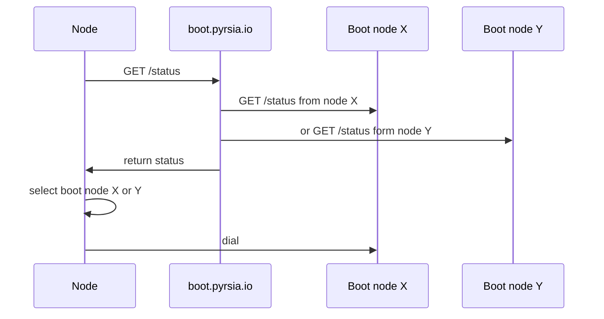
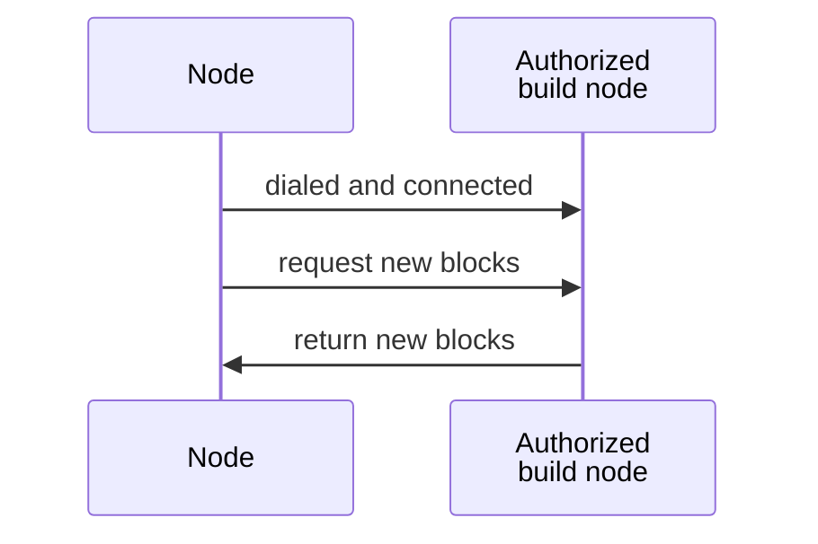
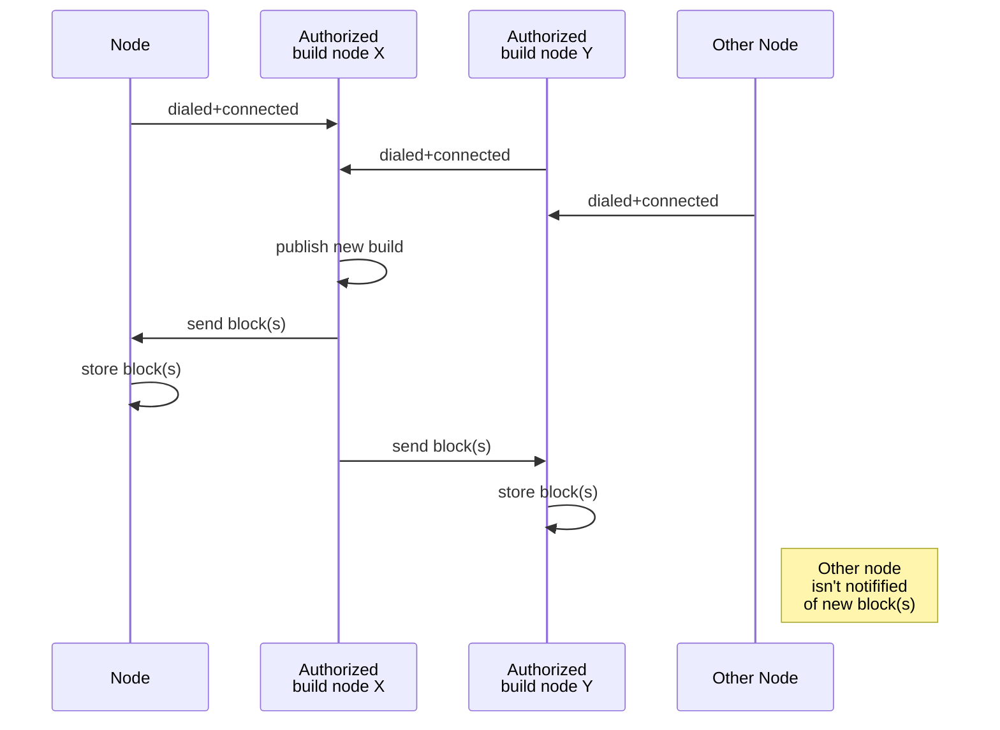
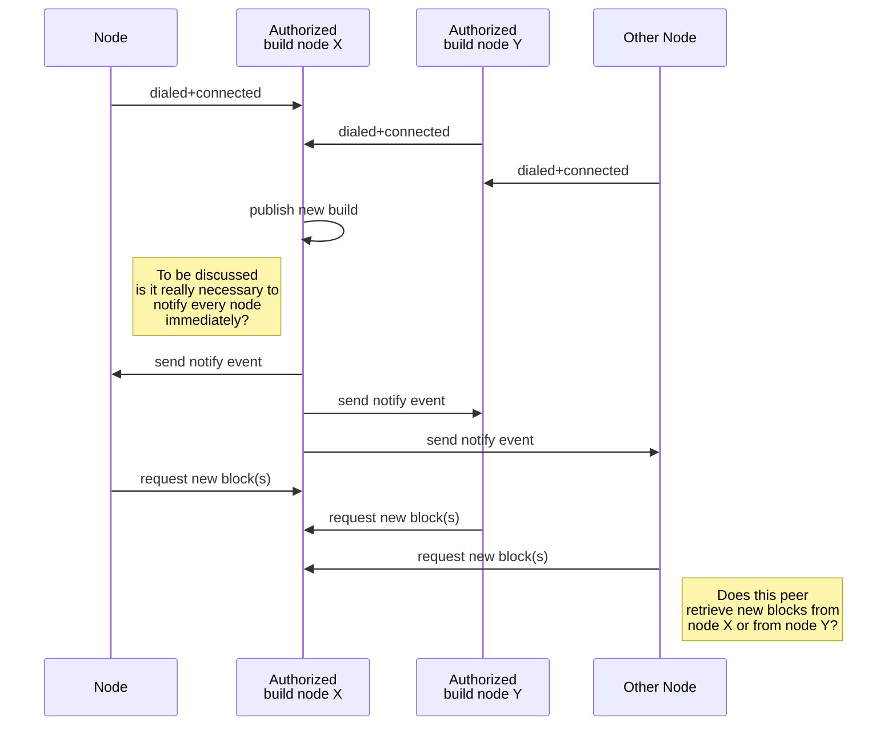
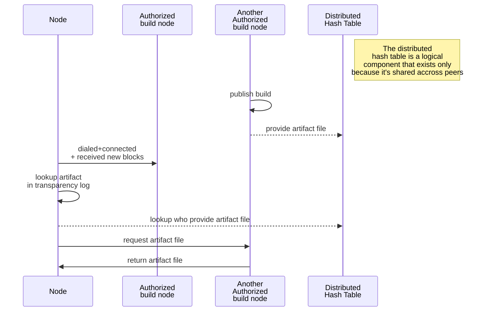

# Pyrsia p2p use cases

## Bootstrapping

Questions:
- We seem to dial every 20s. How to improve?

## Requesting blocks at startup

## Receiving new blocks

### Current situation

### Improved version (to be discussed)

Questions:
- Is it really necessary (functionally) to send a notify event to all peers or could we wait until the peer triggers this itself (e.g. when it needs to look up an artifact)

- In the above scenario, would "Other node" retrieve new blocks from "build node X" or from "build node Y"?

## Retrieve artifact

