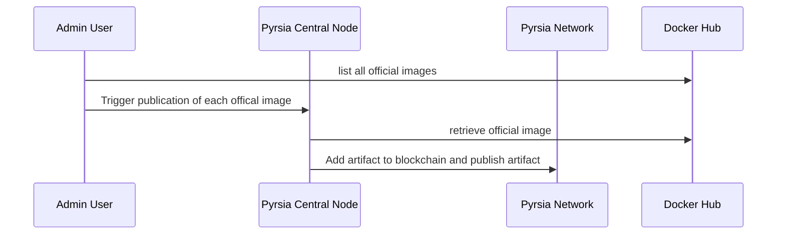
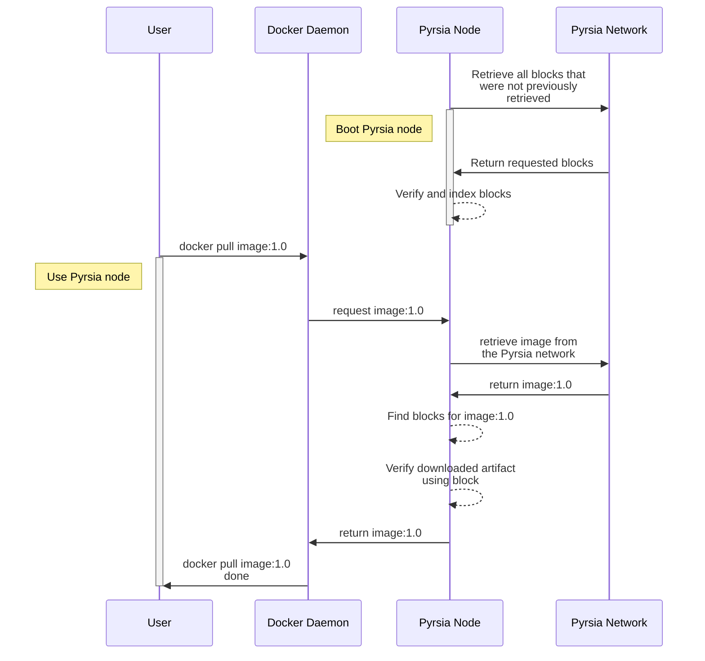

# Pyrsia high level architecture for MVP

> **NOTE**
> This document tries to capture the high-level architecture of Pyrsia for the MVP milestone. At the time of writing it
> is work in progress and will definitely contain errors.

## Use cases

In MVP, we want Pyrsia to support these use cases:

1. A trusted/central node publishes all official Docker images to a p2p network, in such a way that any consumer can verify that a retrieved image was originally published by this trusted/central node.
2. A Docker client configured to use a locally installed Pyrsia node can download verified Docker images from the p2p network.
3. A user can query the transparency log for any downloaded Docker image.

## Docker image publication

### Pyrsia Central Node

A central node is just like any other node, except that it can publish docker images to the network

TODO:
- describe why the central can do this and not any other node
- create issues to make distinction between regular / central node

### Retrieve offical image

This is currently already in place: a script is fetching all offical docker images, and then triggering a fetch from the Pyrsia node. If the image is not found, Pyrsia will fallback to Docker Hub and publish the image on the Pyrsia network.

TODO:
- describe how this already works in practice (Steve T)
- make sure this Docker Hub fallback only works on central nodes

### Add artifact to blockchain and publish

This section in particular needs to be worked out in much more detail, but I imagine it would work like this:

- the node downloads the offical Docker image from Docker Hub
- it uses a blockchain API to store a 'AddArtifact' transaction. the payload is at least an identifier of the image (e.g. alpine:1.0) and the hash of the image. (in later phases we will want to store all metadata, but in MVP this doesn't seem to be necessary)
- when the blochchain API confirm the transaction is added, the node stores the docker image locally and provides it on the p2p network so other peers can download it. (this is already in place)
- in the process, the new transaction block must somehow be made available to other peers

TODO:
- define blockchain API for use in the Pyrsia node code
- define how blockchain consensus will work in this case. do we need consensus in MVP?
- define how blocks are made available to other nodes

## Artifact retrieval

### Retrieve all blocks

We assume that in MVP phase all Pyrsia nodes will be able to download and index all blocks. The size and amount of blocks will be limited so in this phase it shouldn't pose any problems.

TODO:
- In close relation to how the central node is making blocks available, define how a regular node can retrieve blocks
- We also need a mechanism to somehow retrieve only new blocks, so they don't have to be downloaded at every boot of the node.

### Verify and index blocks

When a block is retrieved the Pyrsia node needs to verify it.
When verified, the Pyrsia node needs to index the block so it can be found when needed. In MVP I think the most important use case will be to find a block based on the artifact ID. (e.g. alpine:1.0)
This way, when a verification of a certain image needs to happen, the block can be easily found using this index.

TODO:
- define blockchain API that allows verification of retrieved blocks
- explore what index mechanism can be used to index blocks

### Retrieve image from the Pyrsia network

This part is already in place.

TODO: add a high-level description here documenting how this works

### Find blocks for image:1.0

This section needs to be discussed in detail, but I imagine it would work like this:
- Using the index described above, find the block ID
- Using the block ID, find the block itself (TODO: does Pyrsia need to store blocks itself or can we rely on a blockchain API to retrieve a block by ID)

### Verify artifact

The block found in the previous step contains the hash of the Docker image, so it's now easy to verify this hash is the same as the hash of the downloaded image.

